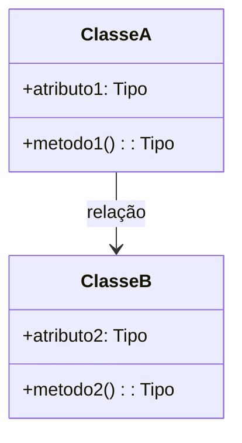
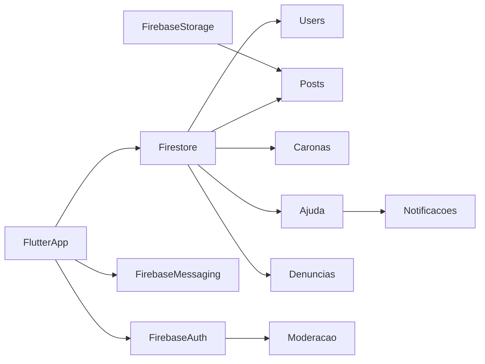

# Documento de Arquitetura e Design

## 1. Arquitetura do Sistema

Descrição geral da arquitetura da aplicação.

### 1.1 Visão Geral da Arquitetura

```mermaid
graph TD
  UI[Interface do Usuário]
  API[Camada de API]
  DB[(Banco de Dados)]
  Auth[Autenticação]
  RFID[Módulo RFID]
  HW[Hardware (Ex: Arduino)]

  UI --> API
  API --> Auth
  API --> DB
  API --> RFID
  RFID --> HW
```

---

## 2. Diagrama de Classes UML



---

## 3. Aplicação dos Princípios SOLID

| Princípio | Aplicação no Projeto |
|----------|------------------------|
| **S** - Responsabilidade Única | |
| **O** - Aberto/Fechado | |
| **L** - Substituição de Liskov | |
| **I** - Segregação de Interfaces | |
| **D** - Inversão de Dependência | |

---

## 4. Justificativa das Decisões

### 4.1 Decisão Importante 1

- **Alternativas Consideradas**:  
- **Critérios de Avaliação**:  
- **Razão da Escolha**:  

### 4.2 Decisão Importante 2

- **Alternativas Consideradas**:  
- **Critérios de Avaliação**:  
- **Razão da Escolha**:  

---

## 5. Análise de Riscos

| Risco Identificado | Probabilidade | Impacto | Estratégia de Mitigação |
|--------------------|---------------|---------|--------------------------|
| Falsificação de Identidade (usuário não Aluno) | Média | Alto/ Médio| Autenticação com RA(da faculdade)|
| Uso malicioso da função de carona |Média  | Alto | Verificação de perfil, histórico de avaliações, denúncia |
| Conteúdo impróprio ou ofensivo na rede social | Alta | Alto/Médio |denúncia por usuários + revisão manual |
| Vazamento de dados pessoais dos alunos | Média |  Alto  | Criptografia de dados sensíveis + autenticação forte |
| Baixa adoção por parte dos alunos | Média |  Médio | Campanhas internas e parcerias acadêmicas|

---

## 6. Plano de Implementação

### 6.1 Sequência de Implementação

1. **Criação do Projeto Flutter e Integração com Firebase**
   - Setup do projeto Flutter (Android/iOS).
   - Integração com Firebase: Auth, Firestore, Storage, Messaging.

2. **Modelagem do Firestore (Banco NoSQL)**
   - Coleções principais:
     - `users` → dados dos alunos (RA, curso, veterano/calouro, etc.).
     - `posts` → feed geral.
     - `caronas` → caronas solidárias.
     - `denuncias` → denúncias de uso indevido.
     - `ajuda` → novo recurso: calouro pede ajuda para veteranos/professores e o Sistema de arona por caridedade ou Gasolina.

3. **Login com RA + Firebase Auth**
   - Autenticação com email/senha e verificação de RA.
   - Campos adicionais como “tipo de usuário” (Calouro, Veterano, Professor).

4. **Feed de Postagens**
   - Upload de imagem + legenda → armazenados no Storage e Firestore.

5. **Sistema de Caronas Solidárias**
   - Criar e buscar caronas.
   - Filtros por destino, horário, vagas, etc.

6. **Sistema de Ajuda Calouro → Veterano/Professor**
   - Calouro seleciona categoria (disciplinas, localização, eventos, etc.).
   - Envia pergunta.
   - Veteranos/professores recebem notificações e podem responder (chat ou reply).
   - Respostas ficam salvas no Firestore.

7. **Sistema de Denúncias**
   - Reportar abusos em posts, mensagens ou perfis.

8. **Notificações via Firebase Cloud Messaging**
   - Nova resposta em ajuda, nova carona, alerta de denúncia etc.

9. **Testes**
   - Testes unitários (`flutter_test`).
   - Testes de integração.
   - Testes manuais com alunos da faculdade.

10. **Deploy**
    - Publicação na Play Store / Firebase Hosting (Web).


### 6.2 Dependências entre Componentes



## 6.3 Estratégias de Teste

| Tipo de Teste           | Descrição                                                                                       |
|-------------------------|-------------------------------------------------------------------------------------------------|
| **Testes Unitários**    | Verificação de funções como autenticação por RA, envio de pedidos de ajuda, criação de caronas. |
| **Testes de Integração**| Teste do fluxo completo: criação e leitura de posts, caronas e pedidos de ajuda no Firestore.   |
| **Testes de Interface** | Simulação da navegação no app, envio de pedidos de ajuda, uso do feed e caronas.                |
| **Testes com Usuários** | Testes com alunos reais da faculdade (beta testers) para validar a experiência e recursos.       |
| **Testes de Segurança** | Aplicação e validação das regras de segurança do Firebase (acesso aos dados, autenticação).     |


---

## 7. Revisão Final

- **Consistência**:  
- **Clareza**:  
- **Completude**:  
- **Aderência aos Requisitos**:  

---

**Autor(es):**  
Nomes dos integrantes : Felipe Santos Rocha, Felipe Rodrigues de Sousa, Heitor Vinicius Giovane Baraveli, Otavio Augusto Zampronio, Luis Eduardo de Lima Santana, José Eduardo Vigidio Silva e João Vitor Amaro Tavares
Disciplina : Engenharia de Software   
Data : 13/05/25


