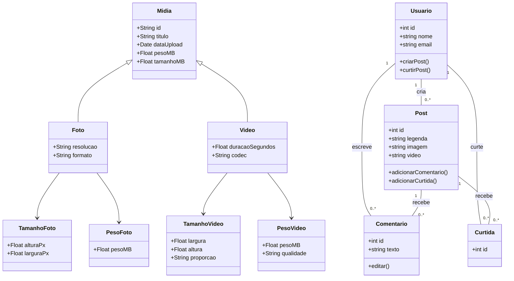
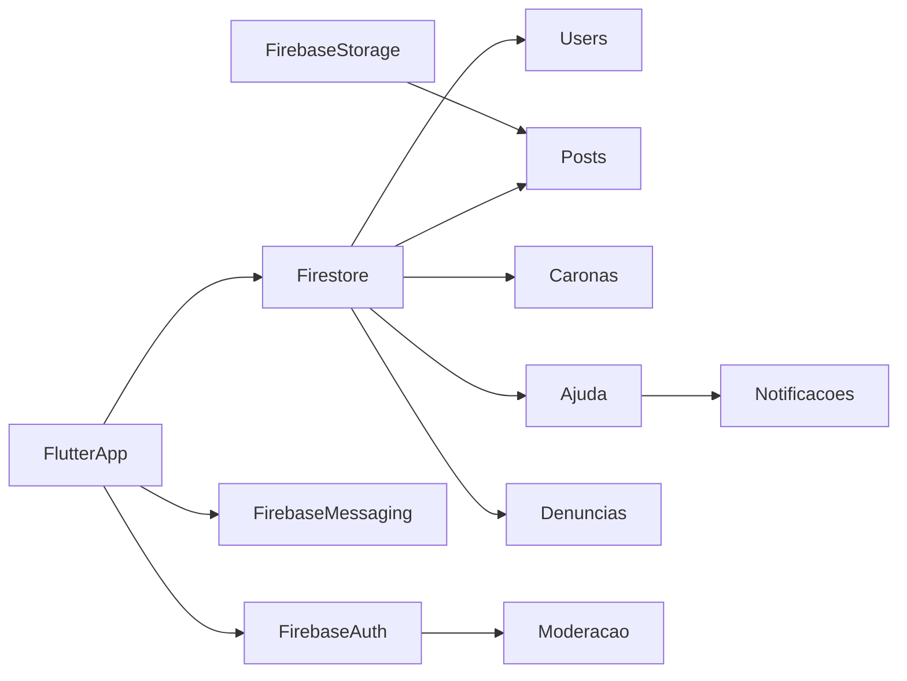

# Definição da Arquitetura do Sistema

## 1. Análise dos Requisitos

### 1.1 Complexidade do Sistema
A complexidade do aplicativo Unimar será de nível médio. Ele contará com um sistema de postagens, onde os usuários poderão curtir e comentar nas publicações. Além disso, o aplicativo incluirá um sistema de mensagens privadas para comunicação entre usuários e um sistema de suporte para atendimento e resolução de dúvidas ou problemas.

### 1.2 Padrões de Uso Esperados
O aplicativo deverá ser acessado por vários usuários simultaneamente, em tempo real. Por isso, é essencial que ele seja capaz de suportar uma grande quantidade de alunos conectados ao mesmo tempo, garantindo um funcionamento rápido, estável e sem prejuízos ao desempenho da rede social.

### 1.3 Requisitos Não-Funcionais
- **Desempenho, Segurança, Escabilidade:**
Desempenho, escalabilidade e segurança são essenciais. A criptografia no envio de mensagens particulares é um requisito importante. A arquitetura também deve ser capaz de lidar com a carga de usuários de forma eficiente.

### 1.4 Restrições Tecnológicas
A plataforma será desenvolvida utilizando tecnologias modernas e amplamente utilizadas. Para a interface (front-end), serão adotadas ferramentas como React/Flutter, garantindo uma experiência de usuário fluida e compatível com diferentes dispositivos móveis. O back-end será implementado em Node.js, oferecendo desempenho e escalabilidade, enquanto o banco de dados utilizado será o PostgreSQL, reconhecido por sua robustez e confiabilidade.

---

## 2. Seleção do Estilo Arquitetural

- **Estilo escolhido:**  
Arquitetura Cliente-Servidor

- **Justificativa da escolha:**  
A arquitetura cliente-servidor foi escolhida por permitir uma comunicação clara entre o front-end e o back-end, além de oferecer boa escalabilidade, organização e segurança. O servidor centraliza funções como autenticação, gerenciamento de dados, postagens e mensagens privadas criptografadas, facilitando o controle e a manutenção do sistema.

---

## 3. Identificação dos Componentes

- **Front-end:** React/Flutter serão utilizados para o desenvolvimento da interface visual do aplicativo, proporcionando uma experiência de usuário moderna, responsiva e compatível com diferentes dispositivos móveis.

- **Back-end:** A parte lógica do aplicativo será responsável por funcionalidades como a criação de postagens, envio de mensagens entre usuários e autenticação de acesso. Essa camada será implementada no back-end e cuidará de todo o processamento das regras do sistema.

- **Banco de Dados:** Será responsável por armazenar todas as informações do sistema, incluindo dados dos usuários, postagens, comentários, perfis e mensagens privadas. Essa camada garante a persistência e a integridade das informações utilizadas pelo aplicativo.

- **Serviços externos:** Módulo dedicado ao gerenciamento de mensagens privadas entre usuários, com suporte a criptografia de ponta a ponta para garantir a segurança e a confidencialidade das conversas.

---

## 4. Definição de Interfaces

- Frontend para Backend: O front-end se comunicará com o back-end por meio de **APIs RESTful**, usando **HTTP/HTTPS**.

- Backend para Banco de Dados: O back-end se comunicará com o banco de dados **PostgreSQL** usando **SQL**.

- Criptografia das Mensagens: O módulo de mensagens privadas usará uma implementação de criptografia ponta a ponta para garantir a privacidade.

---

## 5. Documento de Arquitetura

### 5.1 Visão Geral da Arquitetura
 
 A arquitetura do sistema será baseada no modelo **Cliente-Servidor**, com separação clara entre front-end, back-end e banco de dados. O sistema também contará com integração a serviços externos, como o módulo de mensagens criptografadas. Essa organização permite escalabilidade, facilidade de manutenção e maior segurança no gerenciamento das informações.

---

### 5.2 Diagrama Arquitetural

[Usuário - App (React/Flutter)]
⇅
[Back-end - Node.js]
⇅
[Banco de Dados - PostgreSQL]
⇅
[Serviço de Mensagens Criptografadas]

---

### 5.3 Descrição dos Componentes

- **Front-end:** Responsável pela interface com o usuário, desenvolvido com React/Flutter. Exibe postagens, comentários, mensagens e demais funcionalidades.
  
- **Back-end:** Gerencia a lógica da aplicação, incluindo autenticação, criação de postagens, envio de mensagens, suporte e controle de usuários. Desenvolvido com Node.js.

- **Banco de Dados:** Armazena informações essenciais, como usuários, perfis, postagens, comentários e mensagens privadas, utilizando PostgreSQL.

- **Serviço de Mensagens:** Módulo especializado para envio e recebimento de mensagens privadas com **criptografia ponta a ponta**, garantindo segurança nas comunicações entre usuários.

---

### 5.4 Relações entre os Componentes

- O **front-end** se comunica com o **back-end** via APIs REST.

- O **back-end** se conecta ao **banco de dados** para armazenamento e recuperação das informações.

- O módulo de **mensagens privadas criptografadas** é acionado pelo back-end quando necessário para garantir a privacidade das conversas.

---

### 5.5 Justificativas das Escolhas

As tecnologias e a arquitetura escolhidas garantem um sistema moderno, seguro e escalável. A separação em camadas facilita a manutenção, enquanto o uso de ferramentas populares como React/Flutter, Node.js e PostgreSQL assegura estabilidade, performance e ampla documentação. A criptografia de mensagens é essencial para proteger a privacidade dos usuários em comunicações sensíveis.

---

## 2. Diagrama de Classes UML

---

## 3. Aplicação dos Princípios SOLID

| Princípio | Aplicação no Projeto |
|----------|------------------------|
| **S** - Responsabilidade Única | uma classe para lidar com postagens e outra para login. |
| **O** - Aberto/Fechado | adicionar novos tipos de reação sem alterar o código antigo |
| **L** - Substituição de Liskov |Aluno e Professor devem se comportar como Usuário sem causar erros.|
| **I** - Segregação de Interfaces |  quem só envia mensagens não precisa implementar funções de postagens.|
| **D** - Inversão de Dependência |  usar INotificador para permitir trocar o envio de e-mails por push facilmente. |

---

## 4. Justificativa das Decisões

### 4.1 Decisão Importante 1

- **Alternativas Consideradas**:  
- **Critérios de Avaliação**:  
- **Razão da Escolha**:  

### 4.2 Decisão Importante 2

- **Alternativas Consideradas**:  
- **Critérios de Avaliação**:  
- **Razão da Escolha**:  

---

## 5. Análise de Riscos

| Risco Identificado | Probabilidade | Impacto | Estratégia de Mitigação |
|--------------------|---------------|---------|--------------------------|
| Falsificação de Identidade (usuário não Aluno) | Média | Alto/ Médio| Autenticação com RA(da faculdade)|
| Uso malicioso da função de carona |Média  | Alto | Verificação de perfil, histórico de avaliações, denúncia |
| Conteúdo impróprio ou ofensivo na rede social | Alta | Alto/Médio |denúncia por usuários + revisão manual |
| Vazamento de dados pessoais dos alunos | Média |  Alto  | Criptografia de dados sensíveis + autenticação forte |
| Baixa adoção por parte dos alunos | Média |  Médio | Campanhas internas e parcerias acadêmicas|

---

## 6. Plano de Implementação

### 6.1 Sequência de Implementação

1. **Criação do Projeto Flutter e Integração com Firebase**
   - Setup do projeto Flutter (Android/iOS).
   - Integração com Firebase: Auth, Firestore, Storage, Messaging.

2. **Modelagem do Firestore (Banco NoSQL)**
   - Coleções principais:
     - `users` → dados dos alunos (RA, curso, veterano/calouro, etc.).
     - `posts` → feed geral.
     - `caronas` → caronas solidárias.
     - `denuncias` → denúncias de uso indevido.
     - `ajuda` → novo recurso: calouro pede ajuda para veteranos/professores e o Sistema de arona por caridedade ou Gasolina.

3. **Login com RA + Firebase Auth**
   - Autenticação com email/senha e verificação de RA.
   - Campos adicionais como “tipo de usuário” (Calouro, Veterano, Professor).

4. **Feed de Postagens**
   - Upload de imagem + legenda → armazenados no Storage e Firestore.

5. **Sistema de Caronas Solidárias**
   - Criar e buscar caronas.
   - Filtros por destino, horário, vagas, etc.

6. **Sistema de Ajuda Calouro → Veterano/Professor**
   - Calouro seleciona categoria (disciplinas, localização, eventos, etc.).
   - Envia pergunta.
   - Veteranos/professores recebem notificações e podem responder (chat ou reply).
   - Respostas ficam salvas no Firestore.

7. **Sistema de Denúncias**
   - Reportar abusos em posts, mensagens ou perfis.

8. **Notificações via Firebase Cloud Messaging**
   - Nova resposta em ajuda, nova carona, alerta de denúncia etc.

9. **Testes**
   - Testes unitários (`flutter_test`).
   - Testes de integração.
   - Testes manuais com alunos da faculdade.

10. **Deploy**
    - Publicação na Play Store / Firebase Hosting (Web).

### 6.2 Dependências entre Componentes

## 6.3 Estratégias de Teste

| Tipo de Teste           | Descrição                                                                                       |
|-------------------------|-------------------------------------------------------------------------------------------------|
| **Testes Unitários**    | Verificação de funções como autenticação por RA, envio de pedidos de ajuda, criação de caronas. |
| **Testes de Integração**| Teste do fluxo completo: criação e leitura de posts, caronas e pedidos de ajuda no Firestore.   |
| **Testes de Interface** | Simulação da navegação no app, envio de pedidos de ajuda, uso do feed e caronas.                |
| **Testes com Usuários** | Testes com alunos reais da faculdade (beta testers) para validar a experiência e recursos.       |
| **Testes de Segurança** | Aplicação e validação das regras de segurança do Firebase (acesso aos dados, autenticação).     |

---

**Autor(es):**  
Nomes dos integrantes : Felipe Santos Rocha, Felipe Rodrigues de Sousa, Heitor Vinicius Giovane Baraveli, Otavio Augusto Zampronio, Luis Eduardo de Lima Santana, José Eduardo Vigidio Silva e João Vitor Amaro Tavares
Disciplina : Engenharia de Software   
Data : 13/05/25

