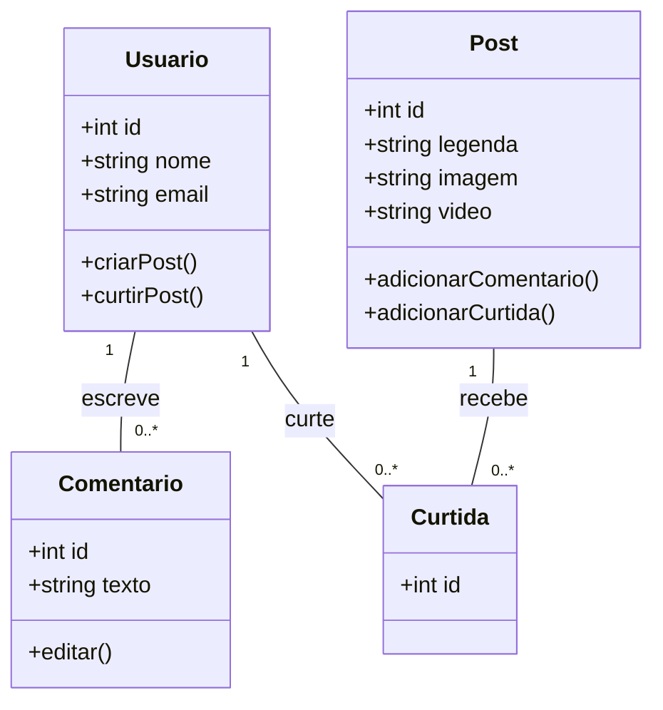

# Documento de Arquitetura

## Histórico de Revisões desde Arquivo

| Data       | Versão | Descrição                | Autor  |
| ---------- | ------ | ------------------------ | ------ |
| DD/MM/AAAA | 1.0    | Versão inicial           | [Nome] |
| 03/06/2025 | 1.1    | [Descrição da alteração] | [Nome] |

## 1. Introdução

### 1.1 Finalidade

este documento tem como o objetivo de descrever o nosso projeto 'instamar'
que é uma rede social voltada para a unimar, é voltada para os alunos se comunicarem
entre si, o documento visa descrever o projeto ao todo, para nos comunicarmos e resolvermos os problemas

[Descrição da finalidade deste documento]

### 1.2 Escopo
o aplicativo tem como o objetivo dos alunos criarem um perfil,
tambem permite os alunos a postarem fotos, postar comentarios, e interagir entre si
lembrando que é um app para o alunos da unimar apenas

[Descrição do escopo da arquitetura]

### 1.3 Definições, Acrônimos e Abreviações

 Termo:     Definição                                   
 InstaMar:  Aplicativo de rede social interna da Unimar 
 MVC:       Model-View-Controller                       
 API:       Interface de Programação de Aplicações     
 DB:        Banco de Dados                              

[Lista de termos, definições, acrônimos e abreviações utilizados no documento]

## 2.1 Representação Arquitetural
 

### 2.1 Modelo Arquitetural
nos escolhemos o modelo MCV(Model-View-Controller) ele separa o codigo de forma separada entre a logica de negocios, a interface com o usuario e o controle de interação  

[Descrição do modelo arquitetural escolhido (ex: MVC, Microserviços, etc.)]

### 2.2 Justificativa
o modelo MVC facilita a manutenção, também ajuda o projeto a ter uma melhor evolução, ajuda também a ter mais clareza para desenvolver, ajuda também na separação das responsabilidades

[Justificativa para a escolha do modelo arquitetural]

## 3. Metas e Restrições da Arquitetura

### 3.1 Metas
Criar um ambiente seguro e restrito para a faculdade(Unimar)

Permitir uma boa comunicação visual entre os alunos

Uma intefaçe rapida e intuitiva (Pareçida com a do Instagram)    

[Lista das metas arquiteturais]

### 3.2 Restrições

Autenticação restrita ao e-mail institucional.

Disponibilidade inicial apenas para Android.

Backend hospedado em servidor gratuito (ex: Render, Vercel ou Firebase).

[Lista das restrições arquiteturais]

## 4. Visão de Casos de Uso

### 4.1 Diagrama de Casos de Uso

[Diagrama ou referência para o diagrama]

### 4.2 Descrição dos Casos de Uso Significativos

Cadastrar-se/Login: Usuário entra com e-mail institucional e cria uma conta.

Postar Foto: O usuário publica uma imagem com descrição.

Curtir/Comentar: O usuário pode interagir com as postagens.

Seguir Usuários: O usuário pode acompanhar publicações de colegas.

[Descrição dos casos de uso mais importantes para a arquitetura]

## 5. Visão Lógica

### 5.1 Visão Geral

Não chegamos a fazer a parte do codigo

[Descrição geral da organização lógica do sistema]

### 5.2 Pacotes de Design Significativos

[Descrição dos pacotes/módulos principais]

### 5.3 Diagramas de Classes

[Diagramas ou referências para os diagramas]

## 6. Visão de Processos

[Descrição dos processos e threads do sistema]

## 7. Visão de Implantação

### 7.1 Diagrama de Implantação

Não foi definido

[Diagrama ou referência para o diagrama]

### 7.2 Descrição dos Nós

App Mobile: Aplicativo Android

API Server: Backend Node.js ou Firebase Functions

Banco de Dados: Firestore ou PostgreSQL

[Descrição dos nós de implantação]

## 8. Visão de Implementação

### 8.1 Visão Geral

O app será desenvolvido com React Native (ou Flutter), com backend em Node.js (Express) ou Firebase, utilizando banco de dados em nuvem.

[Visão geral da implementação]

### 8.2 Camadas

Apresentação (Frontend)

Negócio (API/Controller)

Dados (Model/DB)

[Descrição das camadas da aplicação]

## 9. Visão de Dados

### 9.1 Modelo de Dados

Não foi definido

[Descrição ou referência para o modelo de dados]

## 10. Tamanho e Performance

Não foi definido

[Objetivos e restrições de tamanho e performance]

## 11. Qualidade

Usabilidade: Interface inspirada no Instagram.

Manutenibilidade: Uso de boas práticas, separação de camadas.

Segurança: Login com autenticação via e-mail institucional.

[Atributos de qualidade e como são atendidos pela arquitetura]

## 12. Princípios SOLID Aplicados

[Descrição de como os princípios SOLID foram aplicados na arquitetura]

## 13. Padrões de Design Utilizados

[Descrição dos padrões de design utilizados e em quais componentes]

>[!TIP]
>Ao longo do desenvolvimento, revise este documento para garantir que a implementação esteja alinhada com a arquitetura planejada. Documente as decisões arquiteturais importantes, incluindo as alternativas consideradas e os motivos da escolha final.
